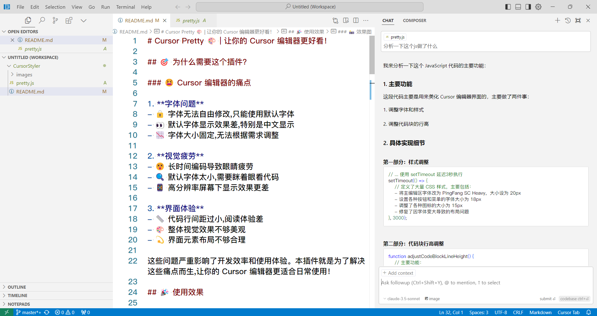
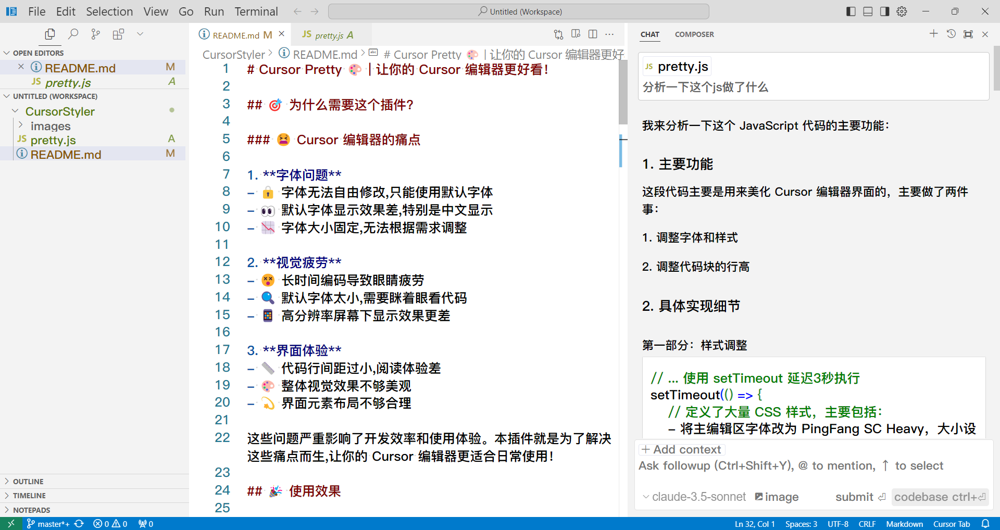

# 🎨 Cursor Pretty | 让你的 Cursor 编辑器更好看！

[English Version](README_en.md) | 中文版

---

## 🎯 为什么需要这个插件?

### 😫 Cursor 编辑器的痛点 

1. **字体问题**
- 🔒 字体无法自由修改,只能使用默认字体
- 👀 默认字体显示效果差,特别是中文显示
- 📉 字体大小固定,无法根据需求调整

2. **视觉疲劳**
- 😵 长时间编码导致眼睛疲劳
- 🔍 默认字体太小,需要眯着眼看代码
- 📱 高分辨率屏幕下显示效果更差

3. **界面体验**
- 📏 代码行间距过小,阅读体验差
- 🎨 整体视觉效果不够美观
- 💫 界面元素布局不够合理

这些问题严重影响了开发效率和使用体验。本插件就是为了解决这些痛点而生,让你的 Cursor 编辑器更适合日常使用！

---

## 🎉 使用效果

更清晰的代码显示、更舒适的阅读体验、更优雅的界面布局！

让你的 Cursor 编辑器焕然一新~ ✨

### 📸 效果图

| 修改前 | 修改后 |
|--------|--------|
|  |  |

| 修改前 | 修改后 |
|--------|--------|
|  |  |

---

## ✨ 功能特性

### 🎯 字体优化
- 📝 主编辑区采用 PingFang SC Heavy 字体
- 📊 代码区字体大小调整为 20px
- 🔍 优化中文显示效果

### 📐 布局美化
- 🎯 智能调整代码块行高
- 📏 优化文件列表间距
- 🎨 美化图标大小和间距
- 🔲 修复边框遮挡问题

### 🛠️ 界面元素调整
- 📋 菜单项字体调整为 18px
- 🔘 按钮文字大小优化
- 📌 下拉列表样式优化
- 🎪 模型选择界面美化

### 🤖 智能处理
- 🔄 每 3 秒自动刷新样式
- 🎯 智能识别不同类型代码块
- 📊 动态计算显示高度
- 🛡️ 防止样式重复注入

### 💡 其他优化
- 🔍 文件路径显示优化
- 🎨 图标大小统一调整为 15px
- 📏 统一行高为 1.5 倍字体大小
- 🎯 优化各类提示信息显示

---

## 🚀 使用方法

### 🔍 步骤0：快速定位 preload.js（推荐方法）

1. 📥 安装 Everything 搜索工具
   - 下载地址: [Everything官网](https://www.voidtools.com/)
   - 安装简单快捷,秒速完成

2. 🔎 搜索定位文件
   - 打开 Everything
   - 输入 "preload.js" 搜索
   - 快速定位到目标文件

> 💡 使用此方法可以跳过步骤1和步骤2,直接进入修改环节

### 📥 步骤 1: 定位安装目录

不同操作系统的默认安装路径:

🪟 Windows: 
- 默认路径: `C:\Users\<YourUsername>\AppData\Local\Programs\Cursor`
- 查找方法: 右键桌面快捷方式,选择"打开文件位置"

🍎 MacOS:
- 默认路径: `/Applications/Cursor.app/Contents/`
- 查找方法: 使用命令 `find /Applications -name "Cursor.app"`

### 📝 步骤 2: 找到 preload.js

在 resources 或 app 目录下查找 preload.js 文件。Windows 典型路径:
`C:/Users/<UserName>/AppData/Local/Programs/Cursor/resources/app/out/vs/base/parts/sandbox/electron-sandbox/preload.js`

### ⚙️ 步骤 3: 修改文件

将本项目里的 **pretty.js** 文件中的代码追加到上一步找到的 **preload.js** 文件末尾。代码会在页面加载后自动调整字体大小，并每 3 秒检查一次变化。

### 🔄 步骤 4: 重启应用

保存修改后重启 Cursor IDE 以使更改生效。

---

## ⚠️ 注意事项

- 🔰 仅在文件末尾追加代码，不影响现有功能
- 💾 建议备份原始文件以防意外
- 🔄 编辑器更新后可能需要重新应用修改
- 🔒 修改前请确保已关闭 Cursor IDE
- ⚡ 如遇样式失效请重新应用修改
- 🎨 可根据个人喜好调整字体大小和样式

---

## 🤝 参与贡献

欢迎通过以下方式参与项目改进：

- 🐛 [Issues](https://github.com/scoful/CursorStyler/issues) - 报告问题或提出建议
- 🎯 [Pull Requests](https://github.com/scoful/CursorStyler/pulls) - 提交代码改进

---

## 📞 联系方式

如有任何问题，请通过以下方式联系：

- 📧 邮箱: [1269717999@qq.com](mailto:1269717999@qq.com)
- 💬 GitHub Issues: [scoful/CursorStyler](https://github.com/scoful/CursorStyler/issues)

---
