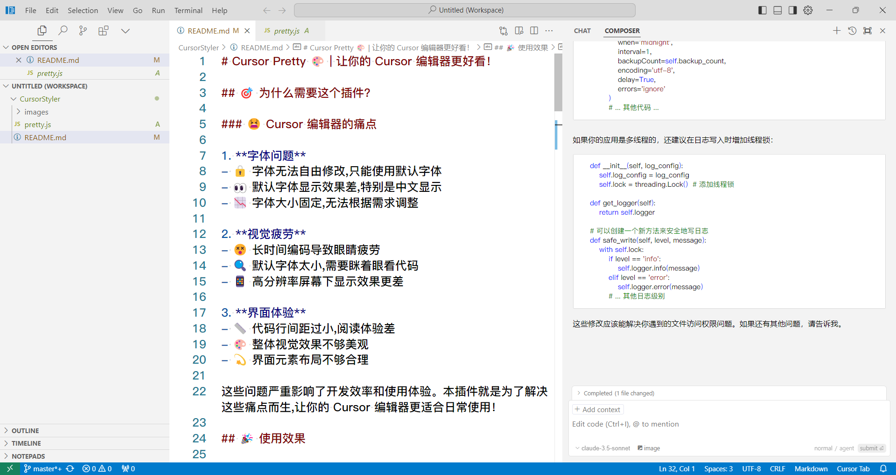
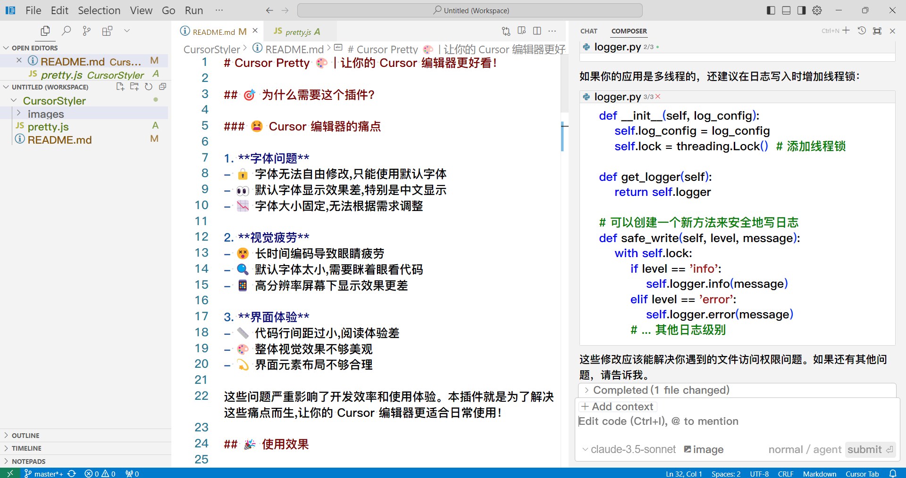
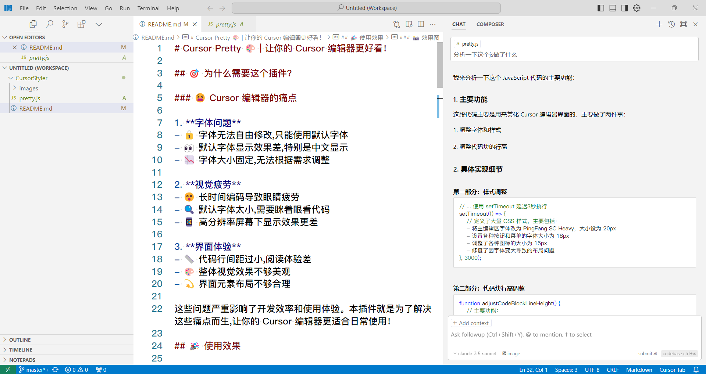
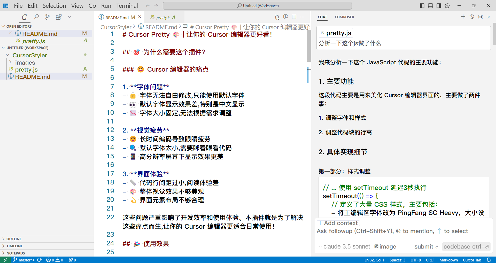

# 🎨 Cursor Pretty | Make your Cursor editor more beautiful!

English Version | [中文版](README.md)

---

## 🎯 Why do you need this plugin?

### 😫 Pain Points of Cursor Editor

1. **Font Issues**
- 🔒 Cannot freely modify fonts, limited to default fonts
- 👀 Poor default font display, especially for Chinese characters
- 📉 Fixed font size, cannot adjust according to needs

2. **Visual Fatigue**
- 😵 Long coding sessions cause eye strain
- 🔍 Default font too small, need to squint to read code
- 📱 Worse display effect on high-resolution screens

3. **Interface Experience**
- 📏 Code line spacing too small, poor reading experience
- 🎨 Overall visual effect not aesthetically pleasing
- 💫 Interface element layout not optimal

These issues seriously affect development efficiency and user experience. This plugin was created to solve these pain points and make your Cursor editor more suitable for daily use!

---

## 🎉 Effects

Clearer code display, more comfortable reading experience, more elegant interface layout!

Make your Cursor editor brand new~ ✨

### 📸 Screenshots

| Before | After |
|--------|--------|
|  |  |

| Before | After |
|--------|--------|
|  |  |

---

## ✨ Features

### 🎯 Font Optimization
- 📝 Main editing area uses PingFang SC Heavy font
- 📊 Code area font size adjusted to 20px
- 🔍 Optimized Chinese character display

### 📐 Layout Beautification
- 🎯 Smart code block line height adjustment
- 📏 Optimized file list spacing
- 🎨 Beautified icon size and spacing
- 🔲 Fixed border overlay issues

### 🛠️ Interface Element Adjustment
- 📋 Menu item font adjusted to 18px
- 🔘 Button text size optimization
- 📌 Dropdown list style optimization
- 🎪 Model selection interface beautification

### 🤖 Smart Processing
- 🔄 Auto-refresh styles every 3 seconds
- 🎯 Smart recognition of different code block types
- 📊 Dynamic height calculation
- 🛡️ Prevent style duplicate injection

### 💡 Other Optimizations
- 🔍 File path display optimization
- 🎨 Icon size uniformly adjusted to 15px
- 📏 Unified line height to 1.5 times font size
- 🎯 Optimized various prompt information display

---

## 🚀 Usage

### 🔍 Step 0: Quick Location of preload.js (Recommended)

1. 📥 Install Everything search tool
   - Download: [Everything Official Website](https://www.voidtools.com/)
   - Quick and easy installation

2. 🔎 Search and locate file
   - Open Everything
   - Search for "preload.js"
   - Quickly locate target file

> 💡 Using this method allows you to skip steps 1 and 2, directly proceeding to modification

### 📥 Step 1: Locate Installation Directory

Default installation paths for different operating systems:

🪟 Windows: 
- Default path: `C:\Users\<YourUsername>\AppData\Local\Programs\Cursor`
- Location method: Right-click desktop shortcut, select "Open file location"

🍎 MacOS:
- Default path: `/Applications/Cursor.app/Contents/`
- Location method: Use command `find /Applications -name "Cursor.app"`

### 📝 Step 2: Find preload.js

Look for preload.js file in resources or app directory. Typical Windows path:
`C:/Users/<UserName>/AppData/Local/Programs/Cursor/resources/app/out/vs/base/parts/sandbox/electron-sandbox/preload.js`

### ⚙️ Step 3: Modify File

Append the code from **pretty.js** in this project to the end of the **preload.js** file found in the previous step. The code will automatically adjust font size after page load and check for changes every 3 seconds.

### 🔄 Step 4: Restart Application

Save changes and restart Cursor IDE for changes to take effect.

---

## ⚠️ Notes

- 🔰 Only append code at file end, doesn't affect existing functionality
- 💾 Recommend backing up original file
- 🔄 May need to reapply modifications after editor updates
- 🔒 Ensure Cursor IDE is closed before modification
- ⚡ If styles become ineffective, reapply modifications
- 🎨 Can adjust font size and style according to personal preference

---

## 🤝 Contributing

Welcome to participate in project improvement through:

- 🐛 [Issues](https://github.com/scoful/CursorStyler/issues) - Report problems or suggestions
- 🎯 [Pull Requests](https://github.com/scoful/CursorStyler/pulls) - Submit code improvements

---

## 📞 Contact

For any questions, please contact through:

- 📧 Email: [1269717999@qq.com](mailto:1269717999@qq.com)
- 💬 GitHub Issues: [scoful/CursorStyler](https://github.com/scoful/CursorStyler/issues)

---
